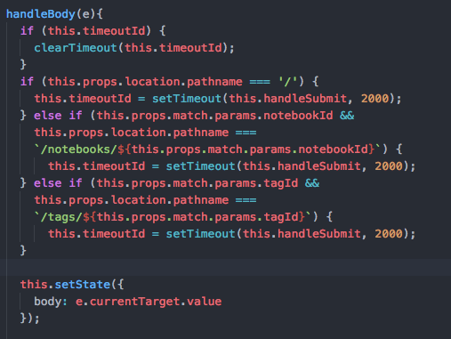
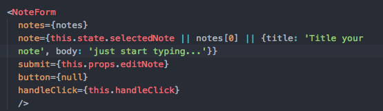
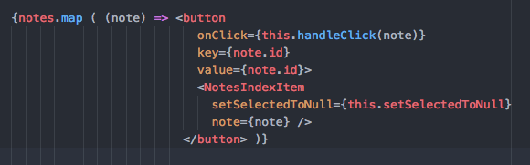

# Clevernote
_________________
- [Evernote](https://evernote.com)
- [Clevernote live](https://Clevernote-.herokuapp.com)

Clevernote is a full-stack web application inspired by Evernote, enabling users to create, edit, and organize collections of notes.
_________________
##### Built using:
- Postgresql database
- Ruby on Rails
- JSON/Jbuilder
- Javascript
- React/Redux
- CSS styling
_________________

## Features & Implementation
_________________

### Note Rendering and Editing
Upon logging in/signing up for Clevernote a default notebook is created and populated with a welcome note via after_create methods in the User model. A user can create a note from the home page and organize/edit existing notes. The notes index is sorted by the updated_at column in the database listing the most recently updated notes first. This allowed me to implement an auto save feature for editing that will update your note dynamically and keep it at the top of the notes index, therefore also making it the default note to be displayed. The user also has the ability to create/delete notes. I've designed Clevernote's UI to mimic the Evernote app for a clean and user-friendly experience.

Below is my implementation of auto-sve which is come in the component's handleChange method:

### Notebooks
On the backend Notebooks have only title and author_id columns, and an association for notes. When a user clicks on the notebooks link a modal appears listing their notebooks and another link to add a notebook. On the frontend I was able to reuse my React components from the notes index page, where the list of notes will only list the selected notebooks notes with the most recently updated note displayed. Editing and adding notes are also possible from within a user's notebook.

Below are two examples of components that were reused for rendering a displayed note, and a note index item with the relevant item's info being passed as props:

### Tags
Tags are connected to notes through a join table in Rails with has-many through associations.  A user can see a list of their current tags as well as what notes have been tagged by a specific tag via a modal (identical to the notebooks modal).

### Future features
I plan to continue working on more features for this project in the near future. Here are a few:

##### Search
I would like to have a search bar at the top of the notes index as well as tags and notebooks index pages as well.

##### Uploading Links
The user should have the ability to upload links from various web pages to store as notes.
